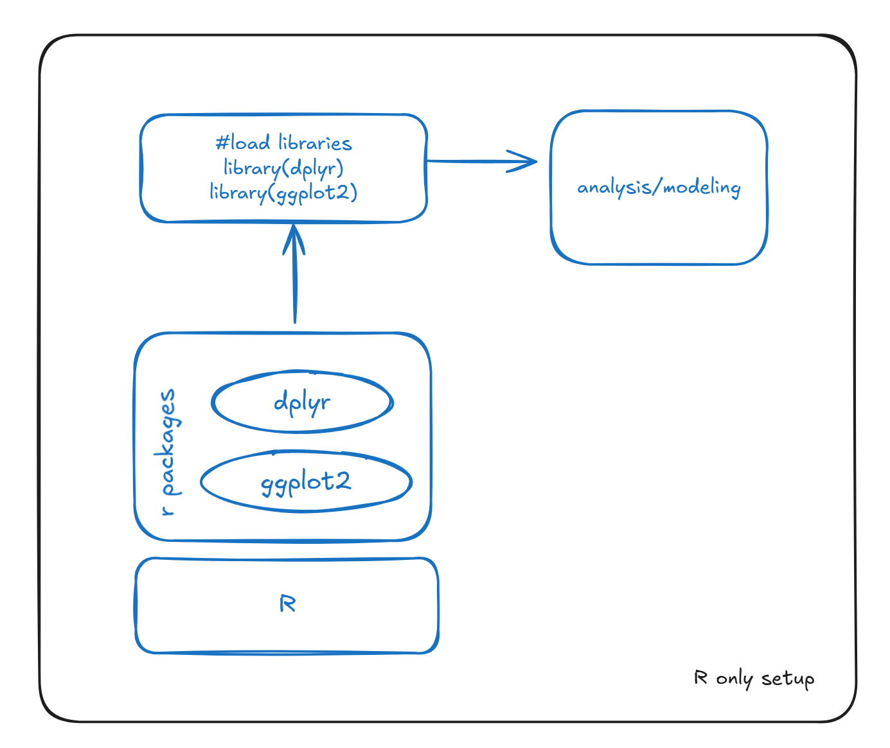
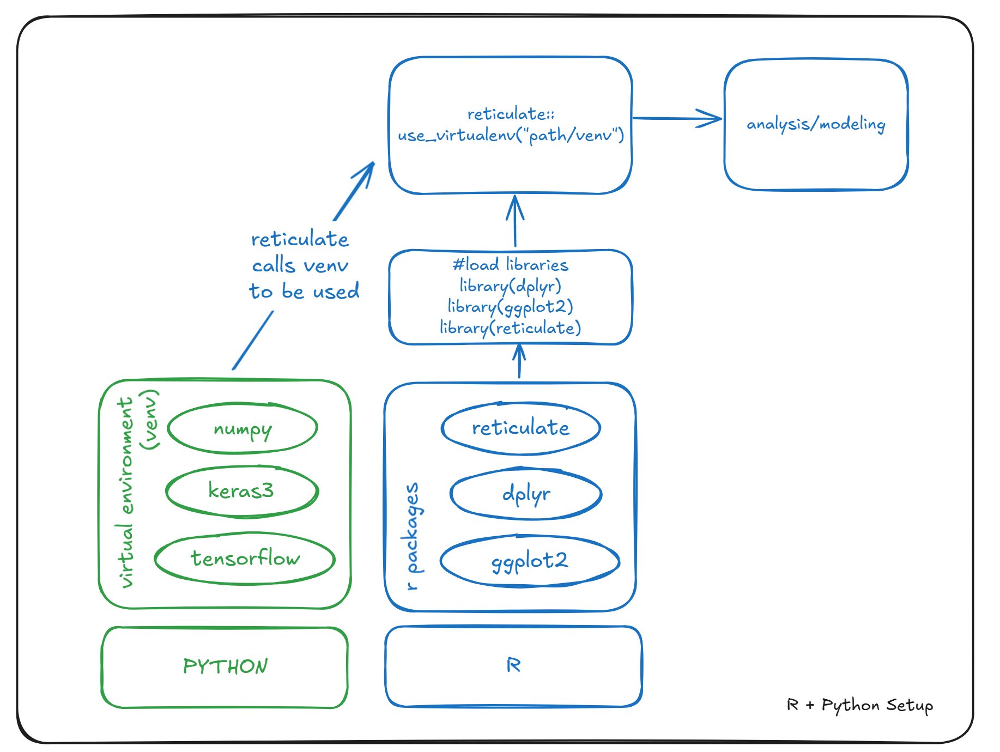

```{r setup, include=FALSE}
#options(repos = c(CRAN = 'https://cran.rstudio.com'))
#install.packages('knitr')
knitr::opts_chunk$set(echo = TRUE)
```

# Setup

Keras is a high-level API for building and training deep learning models. It supports multiple backends, including TensorFlow, JAX, and PyTorch. **Keras3** is the latest version that introduces improvements in usability and functionality, enabling more seamless integration with these backends.

R traditionally handles data analysis and modeling using R packages, typically through environments like RStudio.



However, Keras3 relies on backends like TensorFlow, JAX, or PyTorch, which are Python libraries. This means a Python (version 3.9-3.11) installation is required to use Keras3 in R. Additionally, the Reticulate package is necessary, as it enables R to interface with Python.



## **Installation**

### Python

Although Python v3.13 is out, keras3 package relies on Python v3.9-3.11. Testing has been verified using v3.10. You can download v3.10 from the [python website](https://www.python.org/downloads/release/python-3100/) or by clicking the link for Windows exe [here](https://www.python.org/ftp/python/3.10.0/python-3.10.0-amd64.exe "Python 3.10 Windows Exe Download") (you should not need admin access to download and install).

### Option 1 - Global Install (Buggy)

To install keras3, follow the instructions [here](https://keras3.posit.co/articles/getting_started.html). I have copied the instructions down below.

```{r}
# First, make sure you have reticulate, then install the keras R package:
install.packages("reticulate")
install.packages("keras3")

# or install the development version with:
#remotes::install_github("rstudio/keras") # uncode if need to run 

# The Keras R interface requires that a backend engine be installed. This is TensorFlow by default.
keras3::install_keras(backend = "tensorflow")
```

The Keras R interface requires that a backend engine be installed. This is [TensorFlow](https://www.tensorflow.org/) by default.

This will provide you with default installation of Keras and TensorFlow that is GPU capable, if a GPU is available. If you want a more customized installation, e.g. see the documentation for [`install_keras()`](https://keras3.posit.co/reference/install_keras.html) and the [installation](https://tensorflow.rstudio.com/installation/) section.

> *Note.* When using the keras3::install_keras function. Reticulate will install python \>3.9 & \<3.11, create a virtual environment called "r-keras" which it will install "scipy", "pandas", "Pillow", "pydot", "ipython", "tensorflow_datasets", "keras" (v3 or higher) and whatever backend is chosen (in this case "tensorflow").

### Option 2 - Local Install (Working / Recommended)

If you are getting SSL certificate errors try manually setting the virtual environment locally. In python programming, the common convention is to place the virtual environment within a project directory. This makes it easier to manage dependencies specific to the project and keeps the environment isolated from the global Python installation. This is slightly different to how we usually utilise R - by having packages stored globally, but if we need to push any machine learning models into production, this will keep packages and versions under control.

```{r}

# -- tested with python 3.10 installed --

# Set environment variable to disable SSL verification for pip
Sys.setenv(PIP_NO_VERIFY_CERTS = "true")

# create virtual env in your R project directory
envname =  paste0(getwd(), "/venv")

# set python options which will disable the SSL certificate errors
pip_options = "--trusted-host pypi.org --trusted-host files.pythonhosted.org"

# create env using reticulate
reticulate::virtualenv_create(envname = envname, version = "3.10", packages = NULL)

# install dependencies for keras3 
dependencies = c("scipy", "pandas", "Pillow", "pydot", "ipython", "tensorflow_datasets")

reticulate::py_install(dependencies, pip_options = pip_options, envname = envname)

# increase timeout for tensorflow install as it was throwing errors
pip_options <- c(
  "--timeout=300",          # 5-minute timeout
  "--retries=3",            # 3 retries
  "--trusted-host", "pypi.org", 
  "--trusted-host", "files.pythonhosted.org"
)

# install python keras backend - here we are using tensorflow, other options are jax or pytorch
reticulate::py_install("tensorflow", pip_options = pip_options, envname = envname)

# install python keras 3
reticulate::py_install("keras==3.*", pip_options = pip_options, envname = envname)
```

# Test

Run the small test model below to see if your keras has been setup correctly. If you are using Rstudio via the dockerfile, then just press run.

```{r}

# configure reticulate and the env
library(reticulate)

# Set the virtual environment, this will be needed for every notebook, or script so it knows what python virtual environment to use. 
use_virtualenv(paste0(getwd(), "/venv"), required = TRUE) # if you set up the virtual environment locally 

# Check the Python version being used
py_config()

library(keras3)

# Generate dummy data
x <- matrix(runif(1000), nrow = 100, ncol = 10)
y <- sample(0:1, 100, replace = TRUE)

# Define a model
model <- keras_model_sequential() %>%
  layer_dense(units = 32, activation = 'relu', input_shape = c(10)) %>%
  layer_dense(units = 1, activation = 'sigmoid')

# Compile the model
model %>% compile(
  optimizer = 'adam',
  loss = 'binary_crossentropy',
  metrics = c('accuracy')
)

# Fit the model
model %>% fit(x, y, epochs = 100, batch_size = 32)
```
